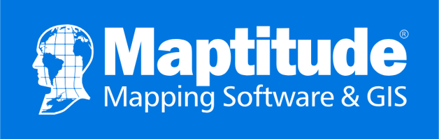

# Maptitude

## Overview

Maptitude is a comprehensive GIS software package developed by Caliper Corporation, designed for business, government, and education users requiring professional mapping and spatial analysis capabilities.

## Core Functionalities

- **Mapping and Visualization**: Create professional maps with customizable symbols, layouts and styles
  - Create-a-Map Wizard for guided map creation
  - Customizable interface and labeling tools
  - 3D visualization capabilities
- **Data Analysis**: Advanced spatial and statistical analysis tools
  - Geographic pattern analysis
  - Statistical reporting and visualization
  - Excel integration for demographic analysis
- **Geocoding**: High-accuracy address conversion and location mapping
- **Routing and Logistics**:
  - Optimal route calculation
  - Single and multiple route optimization
  - Drive time analysis
- **Territory Management**: Sales territory and district creation/management
- **Data Management**:
  - Demographic data handling with Excel reporting
  - 3D imagery and graphical data management
  - Data sharing and collaboration features
- **Additional Features**:
  - Internet mapping capabilities
  - Interoperability with other systems

## Ease of Use & Learning Curve

Maptitude is known for its user-friendly interface with Wizard-driven tools, making it accessible for both technical and non-technical users. Its intuitive design allows users to quickly start mapping, geocoding, and performing spatial analysis.

### Pros

1. **Value for Money**

   - Competitive pricing compared to alternatives
   - Comprehensive feature set included in base package

2. **Output Quality**

   - High-quality map production
   - Professional-grade results

3. **Data and Functionality**

   - Extensive built-in data sets
   - Wide range of analytical tools

4. **User Experience**

   - Easy to learn and use
   - Intuitive interface design

5. **Performance**

   - Fast data manipulation
   - Efficient display and labeling
   - Stable operation

6. **Business Intelligence**

   - Valuable insights for management
   - Growth opportunity analysis

7. **Versatility**
   - Comprehensive mapping capabilities
   - Advanced features like heatmapping

### Cons

1. **Google Earth Integration**
   - Limited visual legend support
   - Complex feature export issues
   - Point display limitations

## Scalability & Performance

Maptitude is designed to accommodate organizations of all sizes across various industries. It efficiently handles:

- Territory optimization
- Route planning
- Regional boundary definition
- Network operations management

## Integration Capabilities

Maptitude offers two-way data synchronization with multiple platforms:

- Microsoft Access
- Microsoft Excel
- Oracle
- SQL Server
- PostgreSQL
- ODBC databases

## Pricing & Licensing

Maptitude offers flexible deployment options:

- Desktop Subscription (offline use without recurring fees)
- Maptitude Online SaaS (web-based solution)
- Custom enterprise solutions

## Community & Support

- Technical support services
- Comprehensive instructional videos
- Online documentation and tutorials
- User community resources

⁂

[^1]: https://www.getapp.com.au/software/2052013/maptitude
[^2]: https://reviews.financesonline.com/p/maptitude/
[^3]: https://www.caliper.com/maptitude/blog/why-maptitude-outshines-arcgis-and-qgis/default.htm
[^4]: https://www.softwarereviews.com/products/maptitude-gis?c_id=78
[^5]: https://wiki.openstreetmap.org/wiki/Maptitude
[^6]: https://www.saasworthy.com/product/maptitude
[^7]: https://www.caliper.com/pdfs/maptitude-2024-new-features.pdf
[^8]: https://www.softwareadvice.com/cafm/maptitude-profile/reviews/
[^9]: https://en.wikipedia.org/wiki/Maptitude
[^10]: https://www.caliper.com/press/testimonials.htm
[^11]: https://www.softwareadvice.com/cafm/maptitude-profile/
[^12]: https://www.reddit.com/r/gis/comments/zcgk2u/is_maptitude_old_hat/
[^13]: http://www.exploregis.spatialfiltering.com/downloads/Maptitude2017UserGuide.pdf
[^14]: https://www3.technologyevaluation.com/solutions/53754/maptitude
[^15]: https://www.caliper.com/maptitude/newfeatures.htm
[^16]: https://www.caliper.com/video/maptitude/maptitude-general-purpose-map-video/maptitude-general-purpose-map-video.html
[^17]: https://www.youtube.com/watch?v=iFdv0lekLrA
[^18]: https://www.caliper.com/video/maptitude/maptitude-tagging-data-video/maptitude-tagging-data-video.html
[^19]: https://www.g2.com/products/maptitude/features
[^20]: https://www.getapp.com/business-intelligence-analytics-software/a/maptitude/features/
[^21]: https://www.gartner.com/reviews/market/geospatial-information-systems-for-energy-and-utilities/vendor/caliper/product/maptitude
[^22]: https://www.goodfirms.co/software/maptitude
[^23]: https://www.youtube.com/watch?v=Rn3OuFqJYVU
[^24]: https://www.g2.com/products/maptitude/reviews
[^25]: https://www.capterra.com/p/93335/Maptitude/
[^26]: https://atlas.co/blog/atlas-vs-maptitude-which-gis-tool-is-right-for-you/
[^27]: https://www.trustradius.com/products/maptitude/reviews
[^28]: https://www.capterra.com/p/93335/Maptitude/reviews/
[^29]: https://www.getapp.com/business-intelligence-analytics-software/a/maptitude/reviews/
[^30]: https://www.softwareadvice.com/cafm/maptitude-profile/
[^31]: https://www.youtube.com/watch?v=fqMXJgD6SgI
[^32]: https://www.linkedin.com/posts/mappingsoftware_try-a-maptitude-trial-when-you-activity-7176961492653613057-NA30
[^33]: https://www.reddit.com/r/gis/comments/zcgk2u/is_maptitude_old_hat/
[^34]: https://www.caliper.com/video/maptitude/maptitude-graphic-formats-video/maptitude-graphic-formats-video.html
[^35]: https://www.linkedin.com/pulse/maptitude-2024-released-stewart-berry-bdzpe
[^36]: https://www.maplibrary.org/1157/best-digital-illustration-software-for-map-details/
[^37]: https://www.caliper.com/press/testimonials.htm
[^38]: https://slashdot.org/software/comparison/BatchGeo-vs-Maptitude/
[^39]: https://sourceforge.net/software/compare/ArcGIS-Insights-vs-Maptitude/
[^40]: https://www.softwarereviews.com/products/maptitude-gis?c_id=78
[^41]: https://www.researchgate.net/publication/256621110_Scalable_Data_Management_for_Map-Reduce-based_Data-Intensive_Applications_A_View_for_Cloud_and_Hybrid_Infrastructures
[^42]: http://www.testmagzine.biz/index.php/testmagzine/article/view/11940/9094
[^43]: https://sourceforge.net/software/product/Maptitude/integrations/
[^44]: https://www.linkedin.com/pulse/supercharge-your-route-planning-python-gis-maptitude-stewart-berry-dvhne
[^45]: https://www.linkedin.com/pulse/maptitude-2024-simplify-territory-management-stewart-berry-6lhhe
[^46]: https://www.trustradius.com/products/maptitude/pricing
[^47]: https://www.g2.com/products/maptitude/pricing
[^48]: https://www.softwaresuggest.com/maptitude
[^49]: https://www.capterra.com/p/93335/Maptitude/pricing/
[^50]: https://www.insight.com/en_US/shop/product/MAP-SW-SUB/maptitude/MAP-SW-SUB/Maptitude-Mapping-Software-Subscription-license-1-user/
[^51]: https://www.insight.com/en_US/shop/product/MAPTITUDESW/maptitude/MAPTITUDESW/Maptitude-Mapping-Software-Subscription-license-1-license/
[^52]: https://subscribed.fyi/maptitude/pricing/
[^53]: https://www.caliper.com/maptitude-online/help/maptitude-online.htm
[^54]: https://umd.libanswers.com/faq/66339
[^55]: https://www.facebook.com/Maptitude/?locale=es_LA
[^56]: https://community.alteryx.com/t5/General-Discussions/Best-Mapping-Software-amp-Location-calcs/td-p/618795
[^57]: https://en.wikipedia.org/wiki/Maptitude
[^58]: https://www.youtube.com/watch?v=UXwiUGzWzz0
[^59]: https://www.caliper.com/maptitude/sample_slides/sample_12.htm
[^60]: https://www.caliper.com/learning/using-other-geographic-file-formats-in-maptitude/
[^61]: https://www.caliper.com/video/maptitude/maptitude-other-file-formats-video/maptitude-other-file-formats-video.html
[^62]: http://www.exploregis.spatialfiltering.com/downloads/Maptitude2017UserGuide.pdf
[^63]: https://www.youtube.com/watch?v=C_KxRQ-u1T8
[^64]: https://www.caliper.com/maptitude/blog/why-maptitude-outshines-arcgis-and-qgis/default.htm
[^65]: https://www.softwareadvice.com/cafm/maptitude-profile/reviews/
[^66]: https://www.caliper.com/maptitude/blog/fortune-50-companies-use-maptitude-for-business-development/default.htm
[^67]: https://www.softwareadvice.com.au/software/140401/maptitude
[^68]: https://www.caliper.com/pdfs/how-maptitude-wins-big-mapping-battles.pdf
[^69]: https://www.caliper.com/maptitude/mapping-software.htm
[^70]: https://www.caliper.com/maptitude/map-data.htm
[^71]: https://www.caliper.com/maptitude/development.htm
[^72]: https://www.trustradius.com/compare-products/google-maps-api-vs-maptitude
[^73]: https://www3.technologyevaluation.com/solutions/53754/maptitude
[^74]: https://slashdot.org/software/p/Maptitude/alternatives
[^75]: https://civitas.eu/tool-inventory/the-maptitude-mapping-software
[^76]: https://www.getapp.com/business-intelligence-analytics-software/a/maptitude/
[^77]: https://www.caliper.com/maptpric.htm
[^78]: https://www.getapp.com.au/software/2052013/maptitude
[^79]: https://www2.caliper.com/store/product/maptitude-mapping-software-subscription/
[^80]: https://www.caliper.com/maptitude/solutions/online-mapping-software-pricing.htm
[^81]: https://www.caliper.com/ushud.htm
[^82]: https://www.caliper.com/training/maptitudetutorials.htm
[^83]: https://www.reddit.com/r/gis/comments/18ijycw/arcgis_vs_maptitude/
[^101]: https://www.saasworthy.com/product/maptitude
[^102]: https://www.softwaresuggest.com/maptitude
[^103]: https://en.wikipedia.org/wiki/Maptitude
[^104]: https://www3.technologyevaluation.com/solutions/53754/maptitude
[^105]: https://www.softwareadvice.com/cafm/maptitude-profile/
[^106]: https://www.caliper.com/maptitude/mapping-software.htm
[^107]: http://www.exploregis.spatialfiltering.com/downloads/Maptitude2017UserGuide.pdf
[^108]: https://www.caliper.com/pdfs/maptitude-2024-new-features.pdf
[^109]: https://www.caliper.com/maptitude/newfeatures.htm
